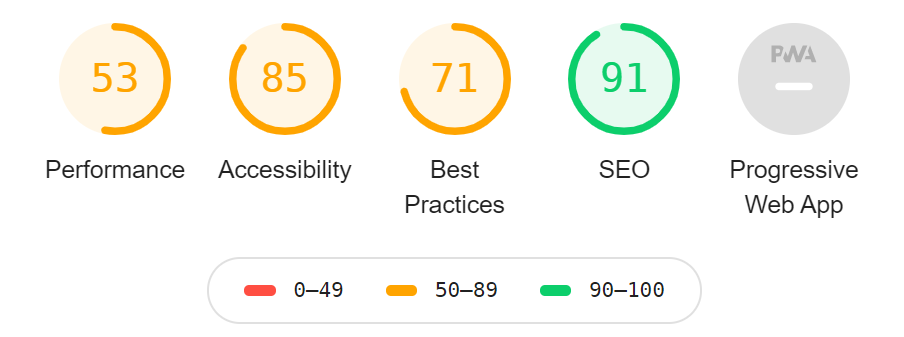

# Website Performance

## Start

 - Erstellen Sie einen Fork des Projektes ([Hilfe](https://docs.gitlab.com/ee/user/project/repository/forking_workflow.html))
 - Um alle Abhängigkeiten des Projektes zu installieren, muss `npm install` im Hauptverzeichnis des Projektes ausgeführt werden ([Hilfe](https://docs.npmjs.com/cli/install)) 
 - Zur Abgabe erzeugen Sie einen Merge Request zum originalen Repository, der Zeitstempel des Merge Request ist wichtig, da dieser als Abgabezeitpunkt zählt ([Hilfe](https://docs.gitlab.com/ee/user/project/merge_requests/creating_merge_requests.html))
 - Das Projekt soll ebenfalls mit einem freien Hosting öffentlich bereitgestellt werden (zb Netlify) ([Hilfe](https://docs.netlify.com/#get-started)).

> Das Projekt ist als netlify Projekt gehostet und kann [hier](https://vigilant-euler-0a6362.netlify.app/) eingesehen werden.

## Aufgabe

Starten Sie den lokalen Web-Server mit `npm start` und öffnen die Website im Google Chrome Web-Browser. Erstellen Sie einen Lighthouse Report, die Werte sollten in etwa der unten gezeigten Grafik entsprechen.

Ziel der Aufgabe ist es folgende Scores mit Lighthouse zu erreichen:

 - Performance > 90
 - Accessibility > 90
 - Best Practices > 90
 - SEO > 90
 - Voll funktionsfähige PWA 

## Links
 
 - [Lighthouse](https://developers.google.com/web/tools/lighthouse/#devtools) mit Chrome DevTools verwenden
 - [jimp](https://www.npmjs.com/package/jimp) und [imagemin](https://www.npmjs.com/package/imagemin) als Beispiele für Werkzeuge um Bilder zu komprimieren
 - [minify](https://www.npmjs.com/package/minify) als Beispiel um Quelltext zu minimieren, kann auch für Bilder verwendet werden
 - [critical](https://github.com/addyosmani/critical) extrahiert das above-the-fold CSS um es als inline-style anzugeben
 - [Lazy Loading](https://developers.google.com/web/fundamentals/performance/lazy-loading-guidance/images-and-video) bezeichnet eine Vielzahl von Techniken um Bilder und Videos effizient zu laden
